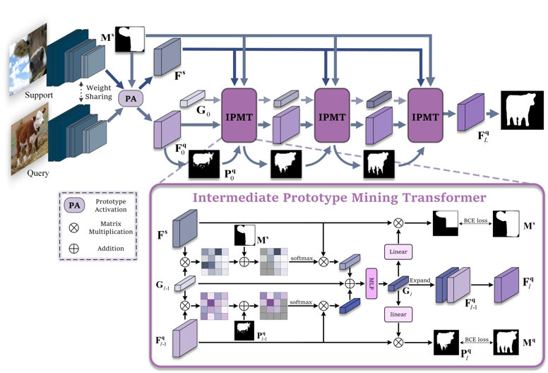

# Intermediate Prototype Mining Transformer for Few-Shot Semantic Segmentation
This repo contains the code for our **NeurIPS 2022** "*Intermediate Prototype Mining Transformer for Few-Shot Semantic Segmentation*" by Yuanwei Liu, Nian Liu, Xiwen Yao, Junwei Han.

> **Abstract:** *Few-shot semantic segmentation aims to segment the target objects in query under the condition of a few annotated support images. Most previous works strive to mine more effective category information from the support to match with the corresponding objects in query. However, they all ignored the category information gap between query and support images. If the objects in them show large intra-class diversity, forcibly migrating the category information from the support to the query is ineffective. To solve this problem, we are the first to introduce an intermediate prototype for mining both deterministic category information from the support and adaptive category knowledge from the query. Specifically, we design an Intermediate Prototype Mining Transformer (IPMT) to learn the prototype in an iterative way. In each IPMT layer, we propagate the object information in both support and query features to the prototype and then use it to activate the query feature map. By conducting this process iteratively, both the intermediate prototype and the query feature can be progressively improved. At last, the final query feature is used to yield precise segmentation prediction. Extensive experiments on both PASCAL- 5i and COCO- 20i datasets clearly verify the effectiveness of our IPMT and show that it outperforms previous state-of-the-art methods by a large margin.*

  

## Dependencies

- Python 3.8
- PyTorch 1.7.0
- cuda 11.0
- torchvision 0.8.1
- tensorboardX 2.14

## Datasets

- PASCAL-5i:  [VOC2012](http://host.robots.ox.ac.uk/pascal/VOC/voc2012/) + [SBD](http://home.bharathh.info/pubs/codes/SBD/download.html)

- COCO-20i:  [COCO2014](https://cocodataset.org/#download)

### Models

- We provide all trained TPMT [models](https://drive.google.com/drive/folders/1qgxKQSQvGOqLqAdzGmnyHuaBUxpesJNE?usp=sharing) for performance evaluation. _Backbone: ResNet50; Dataset: PASCAL-5i; Setting: 1-shot.

## References

This repo is mainly built based on [CyCTR](https://github.com/GengDavid/CyCTR). Thanks for their great work!
